# Guide d'utilisation de l'interface homme-machine

Le projet comporte une interface Web appelée interface "homme-machine" et ça permet de visualiser toutes les données enregistrées par le robot ainsi que la visualisation de la caméra, le contrôle des mouvements des robots et le contrôle de la caméra.

## Onglets disponibles
Sur l'interface Web, il y a 5 onglets différents. 
- Vue d'ensemble
- Vitesse
- Inertiel (IMU)
- Batterie
- Contrôle à distance

Les onglets sont représentés dans l'image ci-dessous.
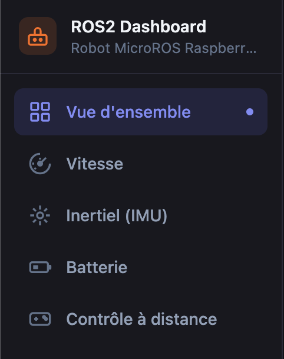

Chaque onglet est expliqué dans sa section attitrée.

## Onglet Vue d'ensemble
Cet onglet permet de voir rapidement des données comme la vitesse actuelle du robot, le pourcentage de la batterie et quelques données de la centrale inertielle.

Voici un exemple de la page "Vue d'ensemble" aussi appelée la page "dashboard" :
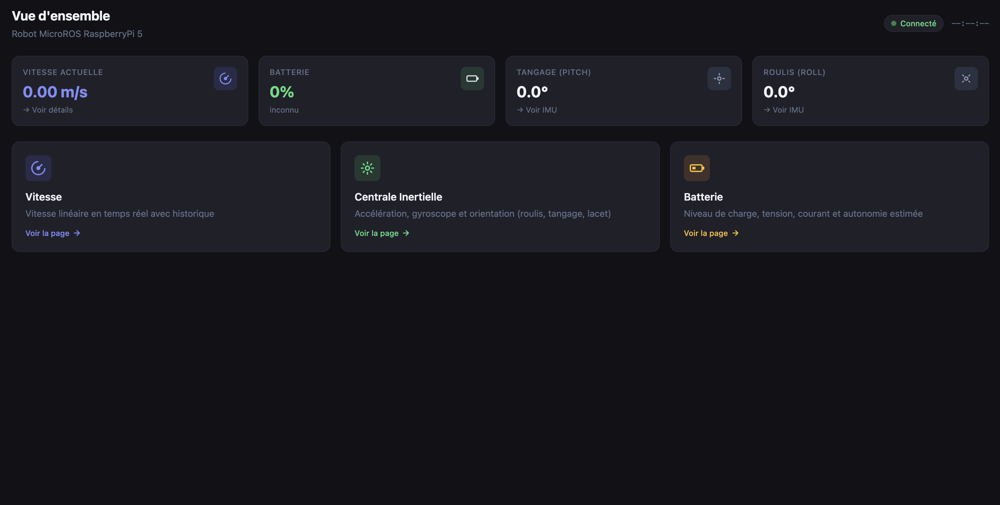

Il y a aussi 3 boutons permettant la navigation rapide vers la page des données comme indiqué dans l'image ci-dessous.
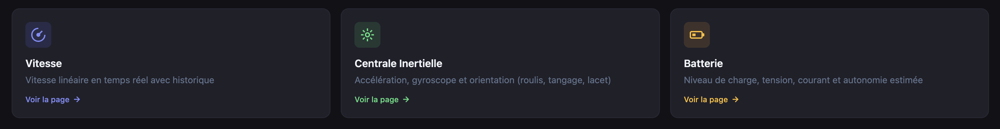

Il y a la possibilité de cliquer sur les rectangles pour naviguer directement sur les pages des données.

## Onglet Vitesse
L'onglet Vitesse permet de visualiser en temps réel la vitesse actuelle du robot en déplacement. Aucun bouton n'est présent dans cette page car elle sert uniquement à la représentation visuelle des données de vitesse.

Il y a des informations sur : 
- La vitesse actuelle
- La vitesse maximale
- La vitesse minimale
- La vitesse moyenne

Il y a aussi un graphe montrant la progression de la vitesse de déplacement du robot. L'image ci-dessous montre un exemple de cette page.

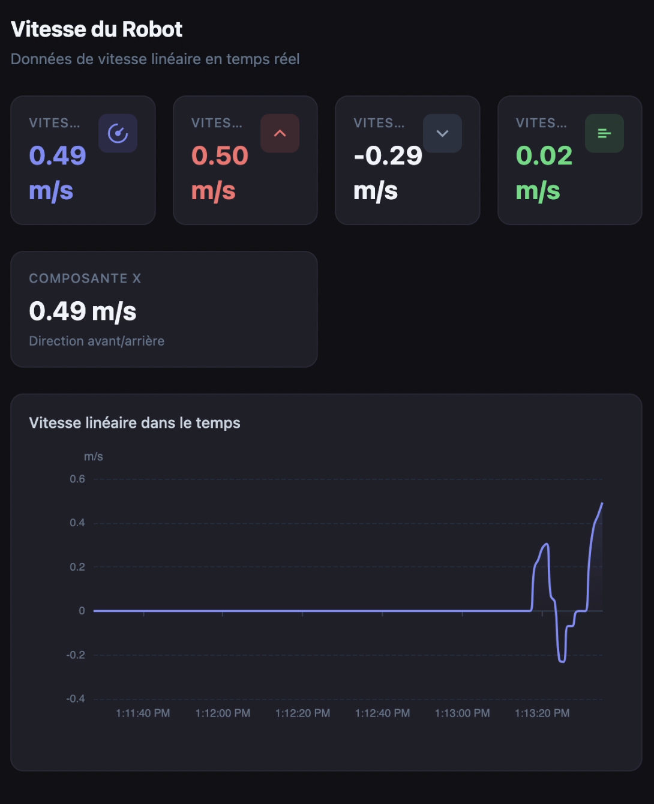

## Onglet Inertiel (IMU)
L'onglet Inertiel (IMU) permet de visualiser les données de la centrale inertielle du robot. Ces données correspondent à l'accélération du robot, au gyroscope du robot et à l'orientation du robot.

La page ne comporte aucun bouton ni aucune action nécessitant l'interaction d'un utilisateur puisque la page sert uniquement à la visualisation des données de la centrale inertielle.

L'image ci-dessous montre un graphe représentant l'accélération du robot.
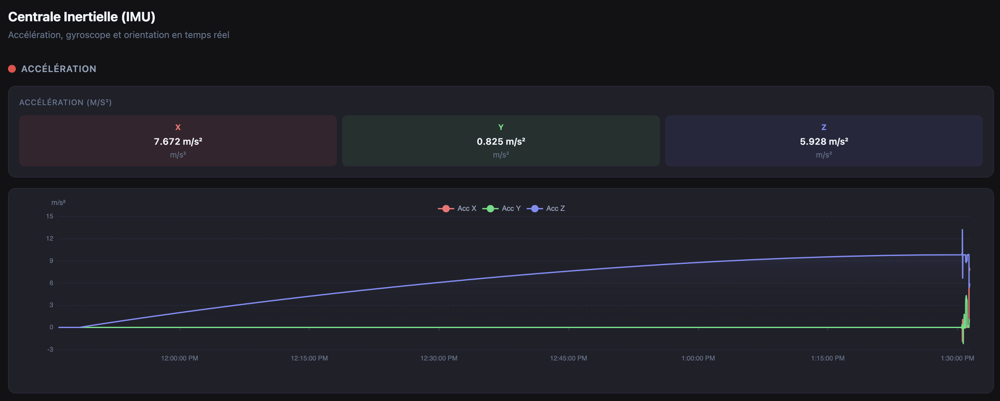

L'image ci-dessous montre un graphe représentant le gyroscope du robot.
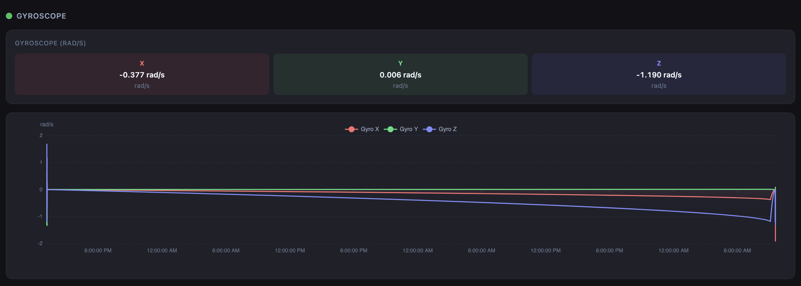

L'image ci-dessous montre un graphe représentant l'orientation du robot.
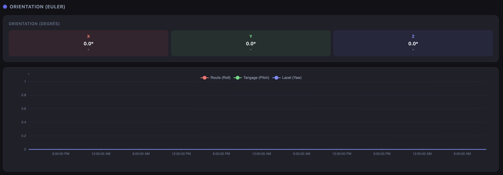

## Onglet Batterie
L'onglet Batterie permet de visualiser les données qui sont en lien avec la batterie du robot. L'image ci-dessous montre un odomètre représentant le pourcentage de la batterie. Sur le côté, il y a d'autres informations en lien avec la tension de la batterie, le courant, la température et la tendance de la batterie si la charge est en hausse, stable ou en baisse.

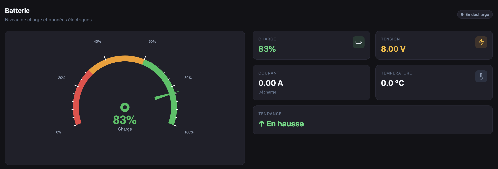

La page Batterie ne comporte aucun bouton et ne nécessite aucune action d'un utilisateur. La page sert uniquement à la visualisation des données en lien avec la batterie du robot.

L'image ci-dessous montre le graphe visuel de l'historique de charge du robot. C'est-à-dire qu'on peut voir sous forme graphique le pourcentage de la batterie du robot.
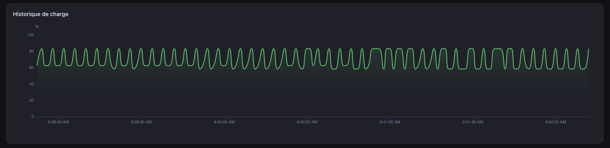

L'image ci-dessous montre le graphe en lien avec la tension de la batterie.
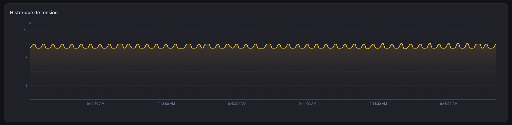

## Onglet Contrôle à distance
L'onglet Contrôle à distance correspond à la page permettant le contrôle des mouvements du robot.
À partir de cette page, un utilisateur peut :
- Faire avancer le robot
- Faire reculer le robot
- Faire tourner le robot à gauche ou à droite
- Faire arrêter le robot
- Pivoter la caméra
- Visualiser le rendu de la caméra
- Gérer la vitesse de déplacement du robot
- Voir s'il y a un obstacle

L'image ci-dessous montre le rendu de la page pour le contrôle à distance.
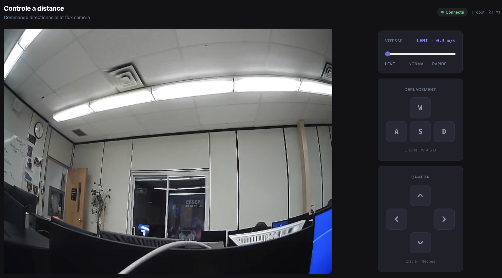

Dans le bas de la page, il y a un petit rectangle indiquant les raccourcis clavier que l'utilisateur peut utiliser pour contrôler le robot.
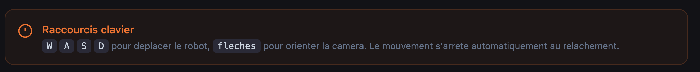

### Faire avancer le robot
À partir de la page Contrôle à distance, un utilisateur peut faire avancer le robot. Il peut appuyer sur la touche `W` du clavier de l'ordinateur ou appuyer directement sur le bouton `W` du clavier intégré dans la page.

### Faire reculer le robot
Un utilisateur peut faire reculer le robot en appuyant sur la touche `S` du clavier de l'ordinateur ou en appuyant directement sur le bouton `S` du clavier intégré dans la page.

### Faire tourner le robot
Un utilisateur peut faire tourner le robot à gauche en appuyant sur la touche `A` du clavier de l'ordinateur ou en appuyant directement sur le bouton `A` du clavier intégré dans la page. Le principe est le même pour tourner à droite. Un utilisateur peut faire tourner le robot à droite en appuyant sur la touche `D` du clavier de l'ordinateur ou en appuyant directement sur le bouton `D` du clavier intégré dans la page.

### Faire arrêter le robot
Un utilisateur peut faire arrêter le robot en n'appuyant sur aucune touche. Le robot est toujours en mode arrêt.

L'image ci-dessous montre le clavier intégré pour faire déplacer le robot sans le clavier d'un ordinateur.
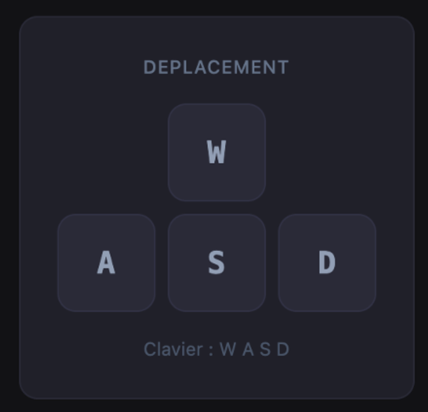

### Pivoter la caméra
La caméra embarquée du robot peut se faire pivoter de gauche à droite ou de haut en bas à partir de la page de contrôle à distance.
Un utilisateur peut utiliser les flèches du clavier de l'ordinateur ou directement utiliser les flèches intégrées dans la page.

L'image ci-dessous montre le clavier avec les flèches pour pivoter la caméra.
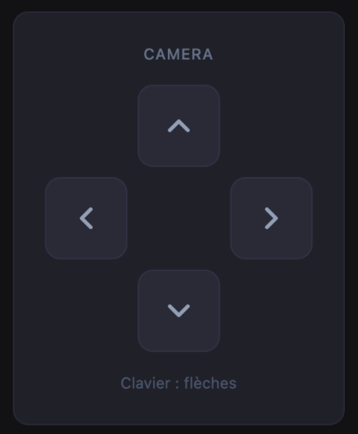

### Visualiser le rendu de la caméra
Un utilisateur peut voir le rendu en direct de la caméra embarquée du robot à partir de la page. L'image ci-dessous montre le rendu vidéo de la caméra.
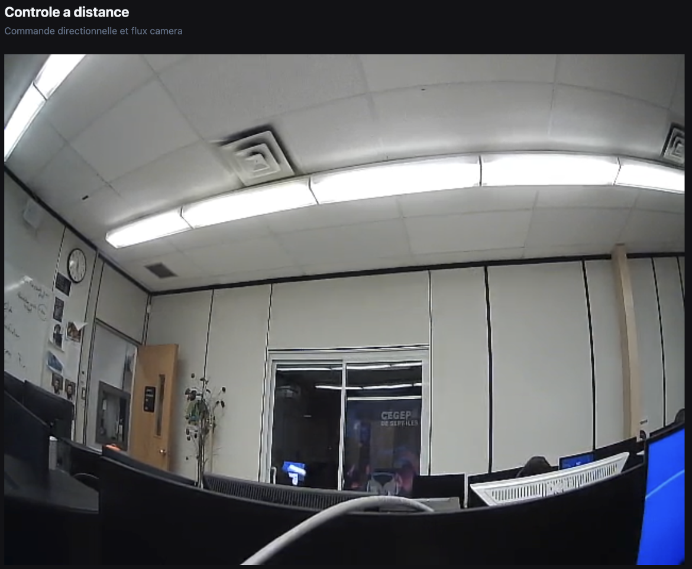

### Gérer la vitesse de déplacement du robot
Un utilisateur peut gérer la vitesse de déplacement du robot avec la jauge intégrée à la page.

Il y a 3 vitesses possibles :
- Lent (0.3 mètre par seconde)
- Normal (0.5 mètre par seconde)
- Rapide (0.7 mètre par seconde)

L'image ci-dessous montre la jauge pour gérer la vitesse de déplacement du robot.
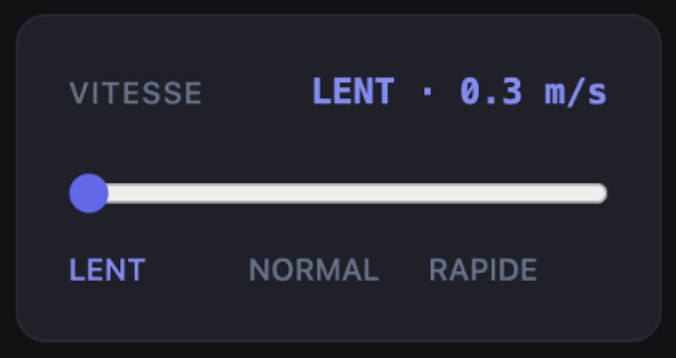

### Voir s'il y a un obstacle
Si le robot détecte un obstacle, la possibilité de faire avancer le robot se bloque automatiquement. L'image ci-dessous montre que le bouton `W` du clavier est bloqué.
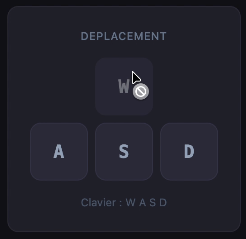

Ainsi, une alerte en haut du rendu vidéo de la caméra est affichée. L'image ci-dessous montre cette alerte.
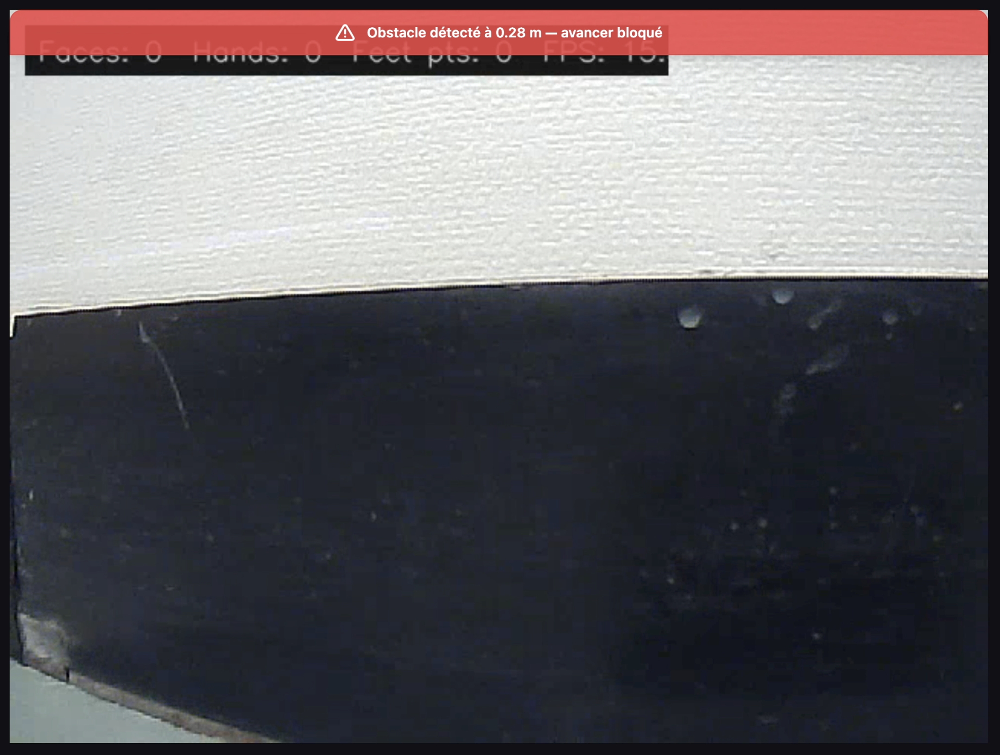
